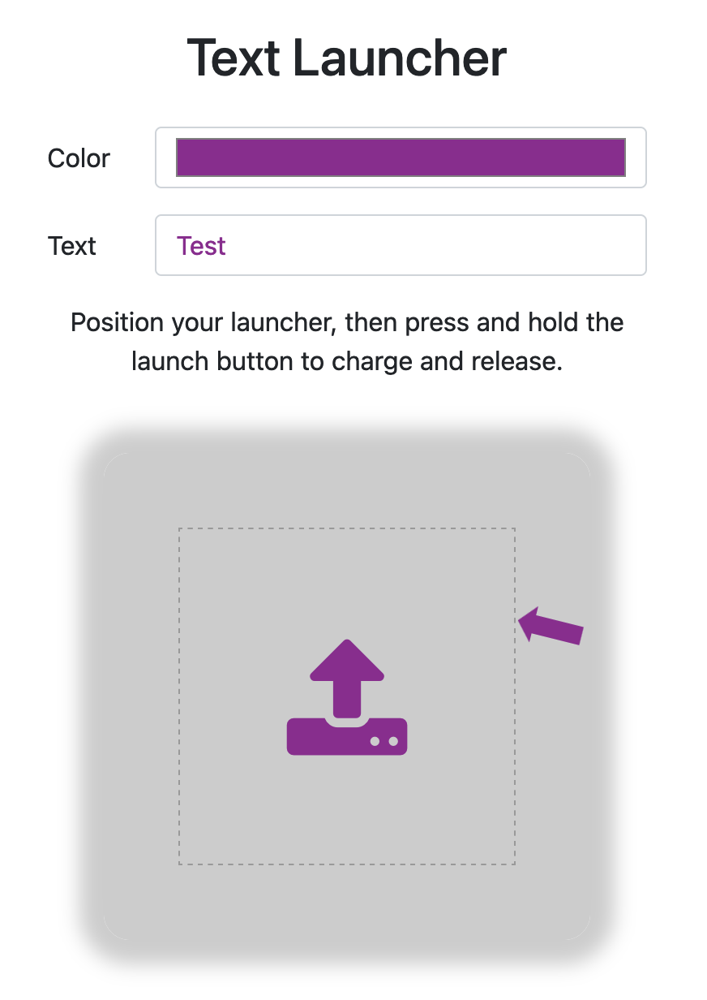
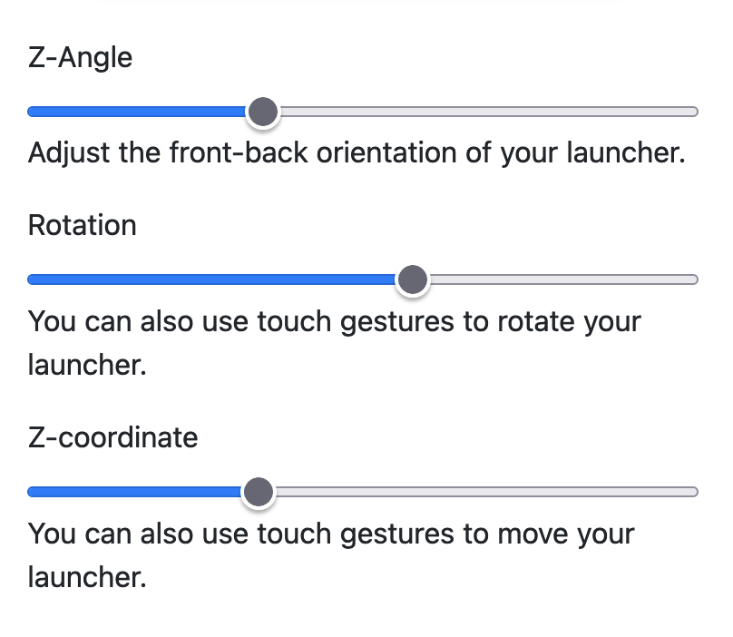
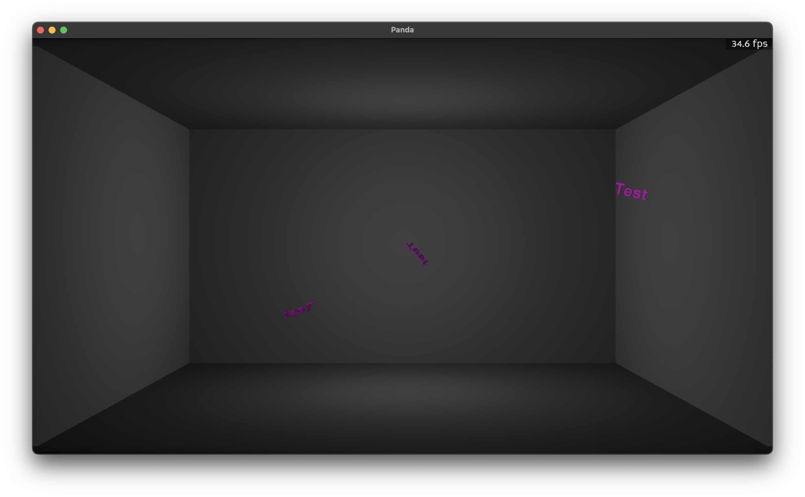

# Collaborative Text Physics Playground

This project was created as an assignment for an Interactive Design course at MIT's
theater program. Due to the pandemic, creating an interactive project usable by
many people at once required creating a web interface to the 3D simulator.

The two components (web interface and 3d display) communicate via a redis-backed
message queue.

### Web Launcher

Run `./web.py` in the `web` subfolder to launch the server, then navigate to the
provided URL and share it with any others you wish to be able to interact.

### 3D Renderer

Run `./base.py` to launch the renderer, which will display the results of user
interactions with the web launcher in real-time.

